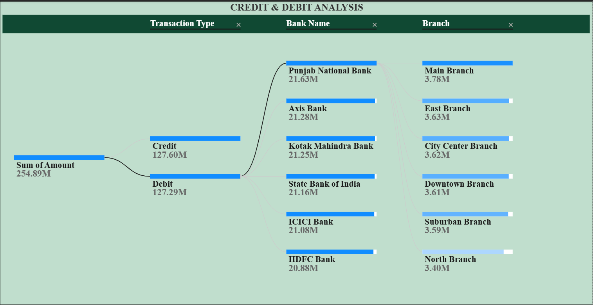
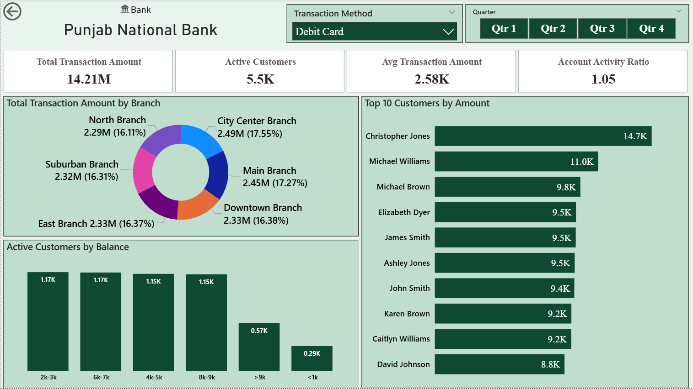
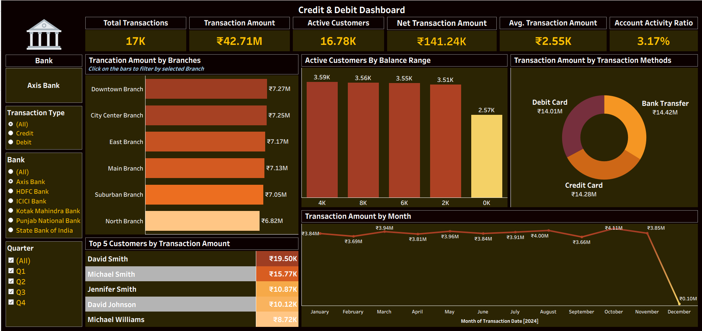

# Credit-Debit-Banking-Transactions-Analysis
End-to-end analysis of 100K+ credit and debit banking transactions using Power BI, Tableau, SQL, and Excel with interactive dashboards and business insights.

## Dataset Information
- Total Records: 100,000
- Year: 2024
- Banks: Axis, ICICI, Kotak Mahindra, SBI, PNB, HDFC
- Branches: North, East, Downtown, Suburban, City Center, Main
- Transaction Types: Credit, Debit
- Payment Methods: Debit Card, Credit Card, Bank Transfer

## Tools Used
- Power BI (DAX, Data Modeling, Dashboards)
- Tableau (Interactive Dashboards)
- MySQL (Querying & Aggregations)
- Excel (Data Cleaning & Validation)

## Business KPIs
- Total Transactions
- Total Credit Amount
- Total Debit Amount
- Credit to Debit Ratio
- Active Customers
- Average Transaction Amount
- Account Activity Ratio

## Power BI Dashboard
### Executive Overview
- Displays total transactions, credit amount, debit amount, and credit-to-debit ratio.
- Shows overall financial stability through balanced inflow and outflow.
- Compares bank-wise net transaction values.
- Highlights growth rate differences among banks.
- Visualizes transaction method distribution.
- Tracks monthly transaction trends.

### Bank Performance Analysis
- Compares banks based on net transaction contribution.
- Identifies top-performing and underperforming banks.
- Highlights Punjab National Bank’s negative net transaction.
- Shows growth rate comparison across banks.
- Enables bank-level filtering and drill analysis.
- Supports strategic benchmarking of bank performance.

### Transaction Method & User Analysis for each bank
- Provides detailed analysis for a selected bank.
- Displays average transaction amount and active customers.
- Shows account activity ratio.
- Analyzes branch-wise contribution.
- Segments customers by balance level.
- Highlights top contributing customers.

## Tableau Dashboard
- Displays key KPIs such as total transactions and total amount.
- Shows branch-wise transaction performance.
- Analyzes customer balance segmentation.
- Highlights top customers by transaction value.
- Tracks monthly transaction trends.
- Provides interactive filters for dynamic exploration.

## SQL Analysis
- SQL queries were used to calculate:
- Bank-wise transaction totals
- Credit vs Debit aggregation
- Average transaction amount
- Customer ranking
- Branch-wise contribution

## Challenges and Solutions
| Challenge                    | Solution                         |
| ---------------------------- | -------------------------------- |
| Large dataset slowed visuals | Optimized model and calculations |
| Date formatting issues       | Converted to proper Date type    |
| Complex relationships        | Applied clean data modeling      |

## Insights
- Credit and debit transactions are almost equal (₹127.60M vs ₹127.29M), indicating a stable and balanced financial flow.
- Transaction methods are evenly distributed across debit cards, credit cards, and bank transfers, showing diversified customer payment behavior.
- ICICI, Kotak Mahindra, and SBI contribute the highest positive net transaction amounts among all banks.
- Punjab National Bank shows a negative net transaction, highlighting a potential performance or retention concern.
- Kotak Mahindra Bank records the highest transaction growth rate, while Axis Bank shows the lowest growth.
- Monthly transaction amounts remain stable throughout the year with a noticeable drop in December, likely due to seasonal or incomplete data.

## Conclusion
This analysis provides a comprehensive view of banking transaction behavior by highlighting financial stability, customer preferences, and bank performance trends. The balanced credit-debit flow and diversified payment methods indicate a healthy transaction ecosystem. Overall, the dashboards enable data-driven decision-making for improving operational and strategic banking outcomes.
